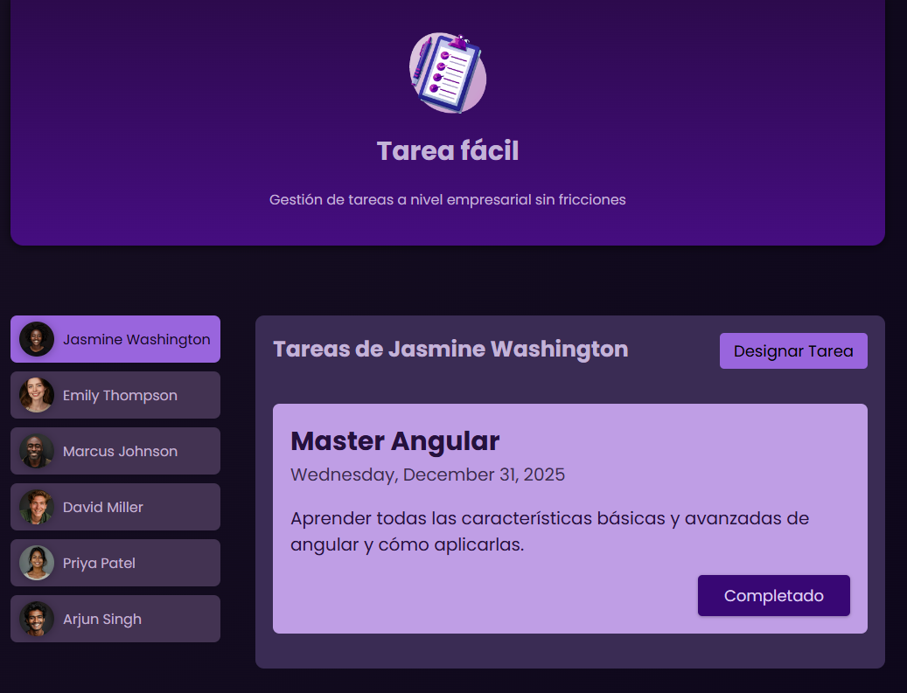
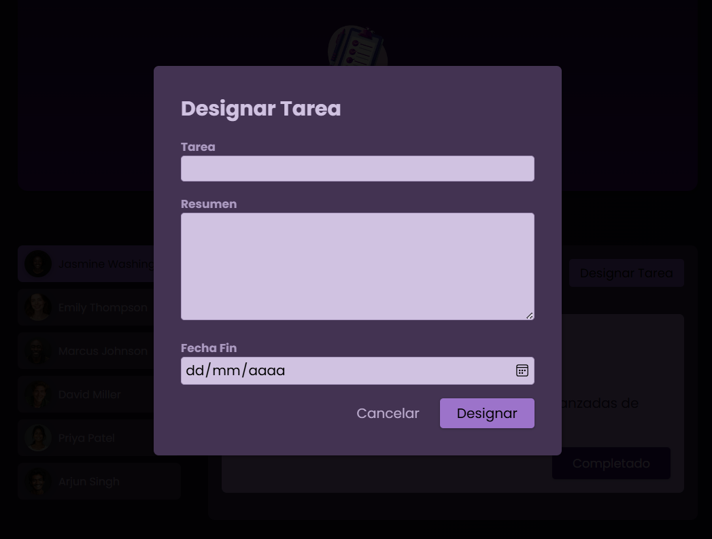

# Tarea Fácil - To-Do List

Gestión de tareas a nivel empresarial sin fricciones.

## Características

- Designar tareas
- Marcar como completado

## Capturas

* ### Pantalla de Inicio



* ### Pantalla de Asignar Tarea



## Instalación y Ejecución

### Pasos:

1. **Clonar el repositorio**:
    ```bash
   git clone https://github.com/WilmerOcampo/to-do-list-ng.git
   cd to-do-list-ng
   ```

2. **Instalar las dependencias**:
    ```bash
    npm install
    ```

3. **iniciar la aplicación**:
    ```bash
    npm start
    ```

#

# ToDoListNg

This project was generated with [Angular CLI](https://github.com/angular/angular-cli) version 17.3.8.

## Development server

Run `ng serve` for a dev server. Navigate to `http://localhost:4200/`. The application will automatically reload if you change any of the source files.

## Code scaffolding

Run `ng generate component component-name` to generate a new component. You can also use `ng generate directive|pipe|service|class|guard|interface|enum|module`.

## Build

Run `ng build` to build the project. The build artifacts will be stored in the `dist/` directory.

## Running unit tests

Run `ng test` to execute the unit tests via [Karma](https://karma-runner.github.io).

## Running end-to-end tests

Run `ng e2e` to execute the end-to-end tests via a platform of your choice. To use this command, you need to first add a package that implements end-to-end testing capabilities.

## Further help

To get more help on the Angular CLI use `ng help` or go check out the [Angular CLI Overview and Command Reference](https://angular.io/cli) page.
